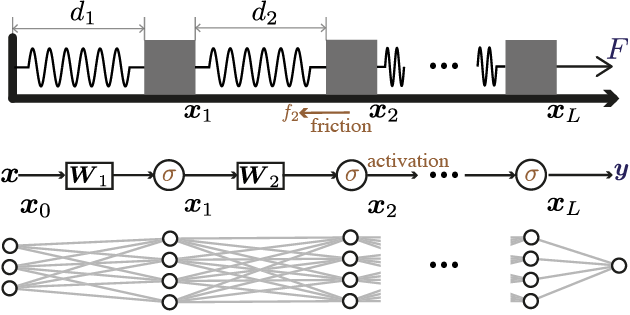
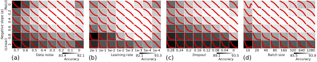

# A spring–block theory of feature learning in deep neural networks
This repository contains the source code and videos for the paper: ___A spring–block theory of feature learning in deep neural networks___. More details can be found [here](https://arxiv.org/abs/2407.19353).

<div style="text-align: center;">
    
</div>


## Amusing vidoes of folding ruler expermenets and DNN training in different regimes
When **slow** and **steady** pulling:

https://private-user-images.githubusercontent.com/13567142/353120192-aa390c65-11ee-41ca-b606-71799b1d969f.mp4?jwt=eyJhbGciOiJIUzI1NiIsInR5cCI6IkpXVCJ9.eyJpc3MiOiJnaXRodWIuY29tIiwiYXVkIjoicmF3LmdpdGh1YnVzZXJjb250ZW50LmNvbSIsImtleSI6ImtleTUiLCJleHAiOjE3MjIyNjQ4MzIsIm5iZiI6MTcyMjI2NDUzMiwicGF0aCI6Ii8xMzU2NzE0Mi8zNTMxMjAxOTItYWEzOTBjNjUtMTFlZS00MWNhLWI2MDYtNzE3OTliMWQ5NjlmLm1wND9YLUFtei1BbGdvcml0aG09QVdTNC1ITUFDLVNIQTI1NiZYLUFtei1DcmVkZW50aWFsPUFLSUFWQ09EWUxTQTUzUFFLNFpBJTJGMjAyNDA3MjklMkZ1cy1lYXN0LTElMkZzMyUyRmF3czRfcmVxdWVzdCZYLUFtei1EYXRlPTIwMjQwNzI5VDE0NDg1MlomWC1BbXotRXhwaXJlcz0zMDAmWC1BbXotU2lnbmF0dXJlPTQ1MTY4NTEwODJjN2NkMzZkNDJhZTRhYWY1MDZkOThhY2IxNWI0OTM5ZmY0NzhkZTUzMTI3MjQ2NjJlMzZlNzcmWC1BbXotU2lnbmVkSGVhZGVycz1ob3N0JmFjdG9yX2lkPTAma2V5X2lkPTAmcmVwb19pZD0wIn0.MlNbIucI9DlbVQyZGOKUv1haswnjMy2-Ls_aTWCe9Fo

and the corresponding training with small learning rate (or large batch size, low dropout, small noise ...) of a non-linear DNN:

https://private-user-images.githubusercontent.com/13567142/353120205-5ea4a245-3c96-45e4-b6bc-c727bd988a96.mp4?jwt=eyJhbGciOiJIUzI1NiIsInR5cCI6IkpXVCJ9.eyJpc3MiOiJnaXRodWIuY29tIiwiYXVkIjoicmF3LmdpdGh1YnVzZXJjb250ZW50LmNvbSIsImtleSI6ImtleTUiLCJleHAiOjE3MjIyNjU2MzcsIm5iZiI6MTcyMjI2NTMzNywicGF0aCI6Ii8xMzU2NzE0Mi8zNTMxMjAyMDUtNWVhNGEyNDUtM2M5Ni00NWU0LWI2YmMtYzcyN2JkOTg4YTk2Lm1wND9YLUFtei1BbGdvcml0aG09QVdTNC1ITUFDLVNIQTI1NiZYLUFtei1DcmVkZW50aWFsPUFLSUFWQ09EWUxTQTUzUFFLNFpBJTJGMjAyNDA3MjklMkZ1cy1lYXN0LTElMkZzMyUyRmF3czRfcmVxdWVzdCZYLUFtei1EYXRlPTIwMjQwNzI5VDE1MDIxN1omWC1BbXotRXhwaXJlcz0zMDAmWC1BbXotU2lnbmF0dXJlPTViNGViZGM4MGJjNmZmOTNkNzk0ZWM2NThhZWQzYTY0MTViZWRhM2FmZjA1ZmNjNmU0NGMyYjE2MmVhOTNkZTYmWC1BbXotU2lnbmVkSGVhZGVycz1ob3N0JmFjdG9yX2lkPTAma2V5X2lkPTAmcmVwb19pZD0wIn0.2X3QKcRjpryy8MLai9fcrA5dlFuVXeKGVGmUlloo6pk

---

When **quick** and **jerky** pulling:

https://private-user-images.githubusercontent.com/13567142/353120463-a65685be-5647-4dea-a518-0783ce17afe8.mp4?jwt=eyJhbGciOiJIUzI1NiIsInR5cCI6IkpXVCJ9.eyJpc3MiOiJnaXRodWIuY29tIiwiYXVkIjoicmF3LmdpdGh1YnVzZXJjb250ZW50LmNvbSIsImtleSI6ImtleTUiLCJleHAiOjE3MjIyNjU3ODUsIm5iZiI6MTcyMjI2NTQ4NSwicGF0aCI6Ii8xMzU2NzE0Mi8zNTMxMjA0NjMtYTY1Njg1YmUtNTY0Ny00ZGVhLWE1MTgtMDc4M2NlMTdhZmU4Lm1wND9YLUFtei1BbGdvcml0aG09QVdTNC1ITUFDLVNIQTI1NiZYLUFtei1DcmVkZW50aWFsPUFLSUFWQ09EWUxTQTUzUFFLNFpBJTJGMjAyNDA3MjklMkZ1cy1lYXN0LTElMkZzMyUyRmF3czRfcmVxdWVzdCZYLUFtei1EYXRlPTIwMjQwNzI5VDE1MDQ0NVomWC1BbXotRXhwaXJlcz0zMDAmWC1BbXotU2lnbmF0dXJlPTIzNWRkZDQwZmMxMTA1ZWQ5ZDhkOTJiMGFiZDVhODA1NDU3MjFiNmI0OGVmN2JjYmU4OTlmYzE4MDY4MDI0NGUmWC1BbXotU2lnbmVkSGVhZGVycz1ob3N0JmFjdG9yX2lkPTAma2V5X2lkPTAmcmVwb19pZD0wIn0.08u26cgcpNzMWsDW8nW_Ev_WG1x1YPmI4qlhLrhnkf0

and the corresponding training (or small batch size, high dropout, large noise ...) of a non-linear DNN:

https://private-user-images.githubusercontent.com/13567142/353120135-4017843f-1bf9-4252-9173-53eb0a336abe.mp4?jwt=eyJhbGciOiJIUzI1NiIsInR5cCI6IkpXVCJ9.eyJpc3MiOiJnaXRodWIuY29tIiwiYXVkIjoicmF3LmdpdGh1YnVzZXJjb250ZW50LmNvbSIsImtleSI6ImtleTUiLCJleHAiOjE3MjIyNjQ4MzIsIm5iZiI6MTcyMjI2NDUzMiwicGF0aCI6Ii8xMzU2NzE0Mi8zNTMxMjAxMzUtNDAxNzg0M2YtMWJmOS00MjUyLTkxNzMtNTNlYjBhMzM2YWJlLm1wND9YLUFtei1BbGdvcml0aG09QVdTNC1ITUFDLVNIQTI1NiZYLUFtei1DcmVkZW50aWFsPUFLSUFWQ09EWUxTQTUzUFFLNFpBJTJGMjAyNDA3MjklMkZ1cy1lYXN0LTElMkZzMyUyRmF3czRfcmVxdWVzdCZYLUFtei1EYXRlPTIwMjQwNzI5VDE0NDg1MlomWC1BbXotRXhwaXJlcz0zMDAmWC1BbXotU2lnbmF0dXJlPTZhOWMxYjhkNmQxZDFjZDI3NDFiOTQ4MzkzYzhjMzkzNTZkZjg1YjEzZjJmYzQ0MmM2YmQ3NDM1MjcyNzI0MjYmWC1BbXotU2lnbmVkSGVhZGVycz1ob3N0JmFjdG9yX2lkPTAma2V5X2lkPTAmcmVwb19pZD0wIn0.5zpk6otCJlbDoJIgJjryoFrYRj5hkKsrMb_E-0xpHfw

## Reproducing phase diagrams in real neural network


```
./bash/test_pd_ns_nl.sh   # data noise
./bash/test_pd_lr_nl.sh   # learning rate
./bash/test_pd_dp_nl.sh   # drop out
./bash/test_pd_bm_nl.sh   # batch size
```

CNN experiments
```
./bash/test_cnn.sh        # CNN experiments 
```


## Spring block simulation
In the [first notebook](./spring/first_order_iteration.ipynb),  we solve the first-order overdamping system by discrete iteration.

In the [second notebook](./spring/sdeint.ipynb), we solve the second-order stochastic differential equation using [sdeint](https://github.com/mattja/sdeint).
