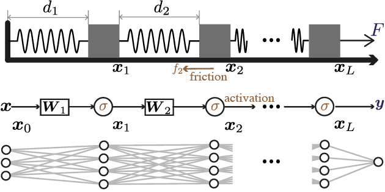
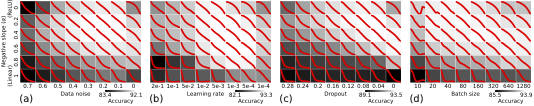

# A spring–block theory of feature learning in deep neural networks
This repository contains the source code and videos for the paper: ___A spring–block theory of feature learning in deep neural networks___. More details can be found on [arXiv](https://arxiv.org/abs/XXXX.XXXXX).

<div style="text-align: center;">
    
</div>


## Amusing vidoes of the folding ruler expermenets and DNN
When **slow** and **steady** pulling:
https://private-user-images.githubusercontent.com/13567142/352864542-8fd9e33a-61ed-472a-a14b-884486cff551.mp4?jwt=eyJhbGciOiJIUzI1NiIsInR5cCI6IkpXVCJ9.eyJpc3MiOiJnaXRodWIuY29tIiwiYXVkIjoicmF3LmdpdGh1YnVzZXJjb250ZW50LmNvbSIsImtleSI6ImtleTUiLCJleHAiOjE3MjIxOTc1MzIsIm5iZiI6MTcyMjE5NzIzMiwicGF0aCI6Ii8xMzU2NzE0Mi8zNTI4NjQ1NDItOGZkOWUzM2EtNjFlZC00NzJhLWExNGItODg0NDg2Y2ZmNTUxLm1wND9YLUFtei1BbGdvcml0aG09QVdTNC1ITUFDLVNIQTI1NiZYLUFtei1DcmVkZW50aWFsPUFLSUFWQ09EWUxTQTUzUFFLNFpBJTJGMjAyNDA3MjglMkZ1cy1lYXN0LTElMkZzMyUyRmF3czRfcmVxdWVzdCZYLUFtei1EYXRlPTIwMjQwNzI4VDIwMDcxMlomWC1BbXotRXhwaXJlcz0zMDAmWC1BbXotU2lnbmF0dXJlPTIwYWZlYWNiNDA5MzczMDI1YjdjNGUwYmQ0NDY1OWM2ZDM4ZTNkNGVmNjlkNzcyYTAxNzVlMzg0MTFjZmE2Y2QmWC1BbXotU2lnbmVkSGVhZGVycz1ob3N0JmFjdG9yX2lkPTAma2V5X2lkPTAmcmVwb19pZD0wIn0.wGORRXnrPgF6pzcXGpoeRI1HxbbErvj_5jczPKuEMHM

and the corresponding **lazy** training of a DNN on the MNIST dataset:
https://private-user-images.githubusercontent.com/13567142/352864588-649baeb7-5980-4f99-9c8e-8a6e38c39783.mp4?jwt=eyJhbGciOiJIUzI1NiIsInR5cCI6IkpXVCJ9.eyJpc3MiOiJnaXRodWIuY29tIiwiYXVkIjoicmF3LmdpdGh1YnVzZXJjb250ZW50LmNvbSIsImtleSI6ImtleTUiLCJleHAiOjE3MjIxOTgxODQsIm5iZiI6MTcyMjE5Nzg4NCwicGF0aCI6Ii8xMzU2NzE0Mi8zNTI4NjQ1ODgtNjQ5YmFlYjctNTk4MC00Zjk5LTljOGUtOGE2ZTM4YzM5NzgzLm1wND9YLUFtei1BbGdvcml0aG09QVdTNC1ITUFDLVNIQTI1NiZYLUFtei1DcmVkZW50aWFsPUFLSUFWQ09EWUxTQTUzUFFLNFpBJTJGMjAyNDA3MjglMkZ1cy1lYXN0LTElMkZzMyUyRmF3czRfcmVxdWVzdCZYLUFtei1EYXRlPTIwMjQwNzI4VDIwMTgwNFomWC1BbXotRXhwaXJlcz0zMDAmWC1BbXotU2lnbmF0dXJlPTYzODEwOGMzOWNjOWIyM2VhMGVmNjA5OTI4ODE0NDllNGYwNTRkNmM0NjZjNjhmZjU5MTA4YjAyMDg4MGMxNTUmWC1BbXotU2lnbmVkSGVhZGVycz1ob3N0JmFjdG9yX2lkPTAma2V5X2lkPTAmcmVwb19pZD0wIn0.CetVxueR4P82gXkbmWlXwgqk-S6lRdZRuDIgxQEZ8Qs

---

When **quick** and **jerky** pulling:
https://private-user-images.githubusercontent.com/13567142/352865143-62bb8d97-3fa1-4937-a595-575abb2a3160.mp4?jwt=eyJhbGciOiJIUzI1NiIsInR5cCI6IkpXVCJ9.eyJpc3MiOiJnaXRodWIuY29tIiwiYXVkIjoicmF3LmdpdGh1YnVzZXJjb250ZW50LmNvbSIsImtleSI6ImtleTUiLCJleHAiOjE3MjIxOTgxOTksIm5iZiI6MTcyMjE5Nzg5OSwicGF0aCI6Ii8xMzU2NzE0Mi8zNTI4NjUxNDMtNjJiYjhkOTctM2ZhMS00OTM3LWE1OTUtNTc1YWJiMmEzMTYwLm1wND9YLUFtei1BbGdvcml0aG09QVdTNC1ITUFDLVNIQTI1NiZYLUFtei1DcmVkZW50aWFsPUFLSUFWQ09EWUxTQTUzUFFLNFpBJTJGMjAyNDA3MjglMkZ1cy1lYXN0LTElMkZzMyUyRmF3czRfcmVxdWVzdCZYLUFtei1EYXRlPTIwMjQwNzI4VDIwMTgxOVomWC1BbXotRXhwaXJlcz0zMDAmWC1BbXotU2lnbmF0dXJlPTIyMTNmNDBmZmQ4YWFmZTUwMjFlYWY0YjE0NWY5YTJjYmIzYmQ0YjY3NjgzYjY2YmU4ZjZmMjQyNWM5YjNlOWMmWC1BbXotU2lnbmVkSGVhZGVycz1ob3N0JmFjdG9yX2lkPTAma2V5X2lkPTAmcmVwb19pZD0wIn0.1-L3f_pXyAxYjuWKfjtCbNu9fS4un_6OVOAXvo2HkZU
and the corresponding **active** training of a DNN on the MNIST dataset:
https://private-user-images.githubusercontent.com/13567142/352864581-d602e7c1-3d13-4459-abe6-e4cc4b4f5baf.mp4?jwt=eyJhbGciOiJIUzI1NiIsInR5cCI6IkpXVCJ9.eyJpc3MiOiJnaXRodWIuY29tIiwiYXVkIjoicmF3LmdpdGh1YnVzZXJjb250ZW50LmNvbSIsImtleSI6ImtleTUiLCJleHAiOjE3MjIxOTgxODQsIm5iZiI6MTcyMjE5Nzg4NCwicGF0aCI6Ii8xMzU2NzE0Mi8zNTI4NjQ1ODEtZDYwMmU3YzEtM2QxMy00NDU5LWFiZTYtZTRjYzRiNGY1YmFmLm1wND9YLUFtei1BbGdvcml0aG09QVdTNC1ITUFDLVNIQTI1NiZYLUFtei1DcmVkZW50aWFsPUFLSUFWQ09EWUxTQTUzUFFLNFpBJTJGMjAyNDA3MjglMkZ1cy1lYXN0LTElMkZzMyUyRmF3czRfcmVxdWVzdCZYLUFtei1EYXRlPTIwMjQwNzI4VDIwMTgwNFomWC1BbXotRXhwaXJlcz0zMDAmWC1BbXotU2lnbmF0dXJlPTkyOTA5MTRmMzkyZWEyNjA1ZDA4NzQ2ZDJmMDhmZTVhMDNlYjhiNjZjNTZhOWY4NTRhNDJiNDM0MTAyOWMxZmImWC1BbXotU2lnbmVkSGVhZGVycz1ob3N0JmFjdG9yX2lkPTAma2V5X2lkPTAmcmVwb19pZD0wIn0.0h7w7BcrbzQzW3tm9i2HKp1gQ-FTPgE2lo0WwLdHE-o

## Reproducing phase diagrams in real neural network


```
./bash/test_pd_ns_nl.sh   # data noise
./bash/test_pd_lr_nl.sh   # learning rate
./bash/test_pd_dp_nl.sh   # drop out
./bash/test_pd_bm_nl.sh   # batch size
```

## Spring block simulation
In the [first notebook](./spring/first_order_iteration.ipynb),  we solve the first-order overdamping system by discrete iteration.

In the [second notebook](./spring/sdeint.ipynb), we solve the second-order stochastic differential equation using [sdeint](https://github.com/mattja/sdeint).